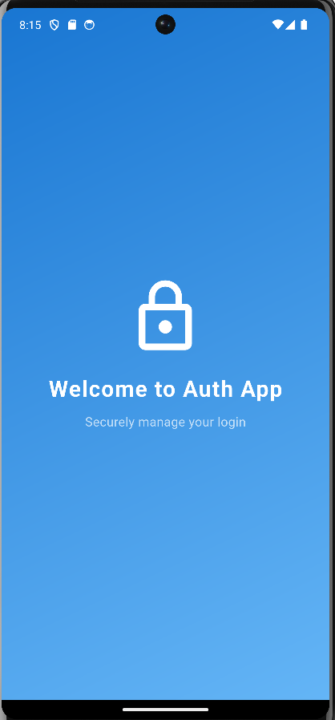
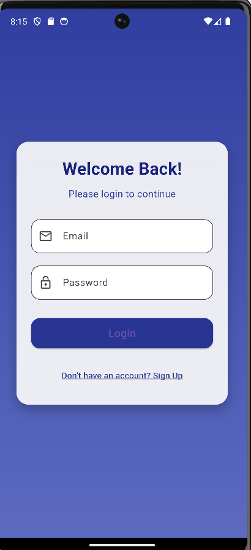
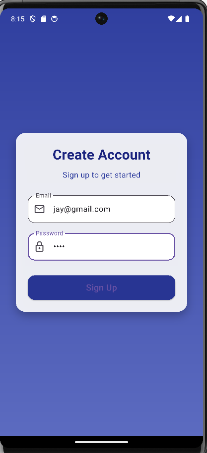
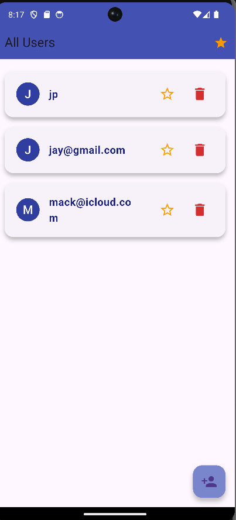
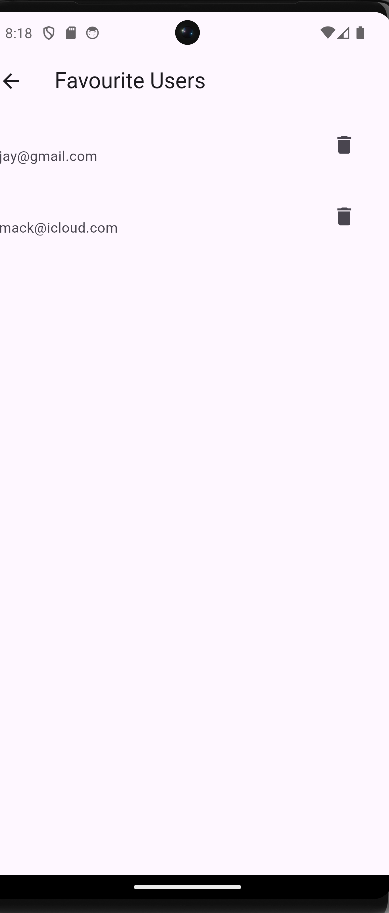
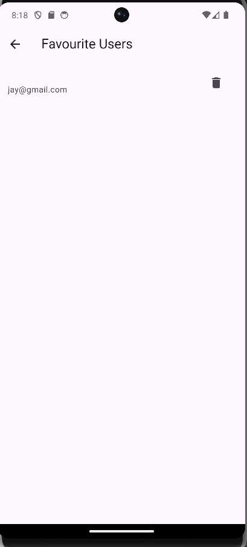
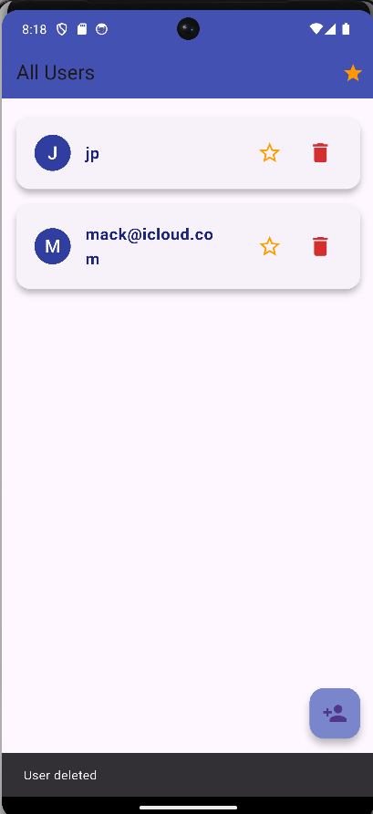

# 🔐 Authentication App

A Flutter app with **Splash Screen**, **Login**, **Signup**, **Homepage**, and **Favourite Users** management using **SQLite** for local data storage.

---

## 🚀 Features

- 🏁 **Splash Screen**  
  Displays a welcoming splash screen on app launch.

- 🔑 **Login Page**  
  User authentication with email and password.

- 📝 **Signup Page**  
  Register new users by providing name, email, and password.

- 🏠 **Homepage**  
  - 👥 Display all registered users.  
  - ➕ Add new users.  
  - ⭐ Mark or unmark users as favourite.  
  - ❌ Remove users from the app.

- 💖 **Favourite Page**  
  - 📋 Show all favourite users.  
  - 🗑️ Remove users from favourites (also deletes them from homepage).

---

## 🔄 User Flow

1. ⏳ App launches showing the **Splash Screen**.  
2. 🔐 User logs in or 📝 signs up.  
3. 🏠 Redirected to **Homepage** where users can be viewed, added, favourited, or deleted.  
4. 💖 Navigate to **Favourite Page** to manage favourite users.

---

## 💾 Data Storage

- Uses **SQLite** for persistent local storage.  
- Tables:  
  - `users` — Stores all user information.  
  - `favourites` — Stores IDs of favourite users.

---

## 📱 Screens Overview

| Screen          | Description                              | Key Actions                               |
|-----------------|----------------------------------------|-------------------------------------------|
| 🏁 Splash Screen  | Displays app logo or animation         | Auto-transition to Login/Signup page      |
| 🔑 Login Page     | Email & password input                  | Login or navigate to Signup page          |
| 📝 Signup Page    | Name, email & password input            | Register new user or navigate to Login    |
| 🏠 Homepage      | List all users                         | Add user, favourite/unfavourite, delete   |
| 💖 Favourite Page | List favourite users                   | Remove users from favourites and app      |

---
  🖼 Screenshots









## ⚙️ How to Run

```bash
git clone <repository-url>
cd authentication_app
flutter pub get
flutter run
